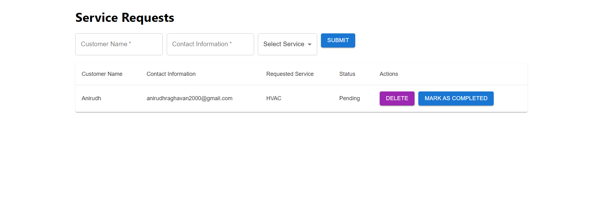

# Service Requests Web Application

A simple web application for managing service requests for a field service company. Built with React for the frontend, Node.js for the backend, and MongoDB as the database.

Frontend: React
Backend: Node.js
DB: Mongo Atlas



## Features

- Create new service requests.
- View all created service requests.
- Edit and delete service requests.
- Each request includes:
  - Unique ID
  - Customer Name
  - Contact Information
  - Requested Service (e.g., HVAC, plumbing)
  - Status (e.g., Pending, Completed)

## Getting Started

### Prerequisites

- [Node.js](https://nodejs.org/)
- [MongoDB](https://www.mongodb.com/) or a MongoDB Atlas account

### Installation

1. Clone the repository
```
git clone https://github.com/your-username/service-requests-webapp.git
cd service-requests-webapp
```

3. Install the required dependencies:

Frontend:
```
npm install
```

Backend:
```
cd services-request-backend
npm install
```

3. Configure environment variables:

In the backend directory, create a `.env` file and add the following (replace the placeholders with actual values):
```
DATABASE_URL=your_mongodb_connection_string
PORT=3001
```


### Running Locally

Frontend:
```
cd services-request-frontend
npm start
```

Backend:
```
cd services-request-backend
node server.js
```


Visit `http://localhost:3000` in your browser.

## Deployment

Both frontend and backend is deployed in two seperate heroku applications

The frontend is deployed on : https://powerful-sea-37477-977d65cf45fc.herokuapp.com/

The backend is deployed on : https://shielded-hollows-86430-85b5383bce16.herokuapp.com/
